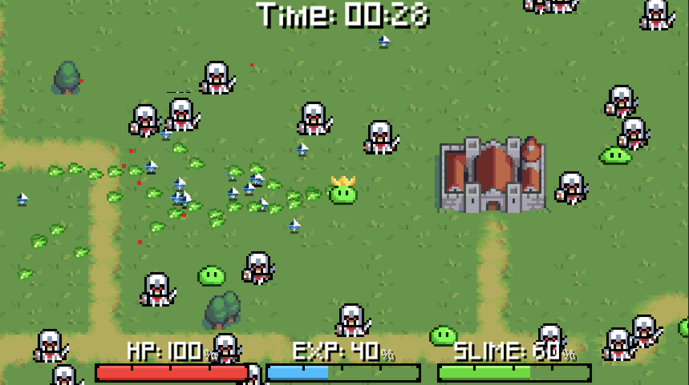
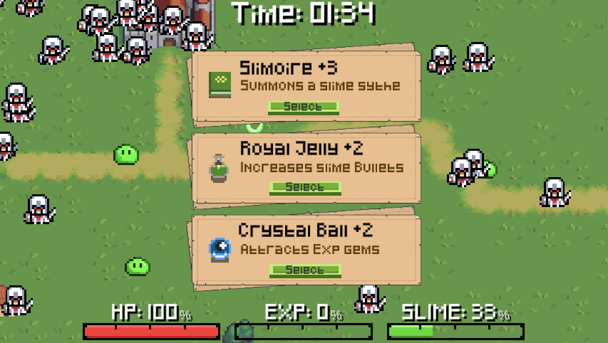
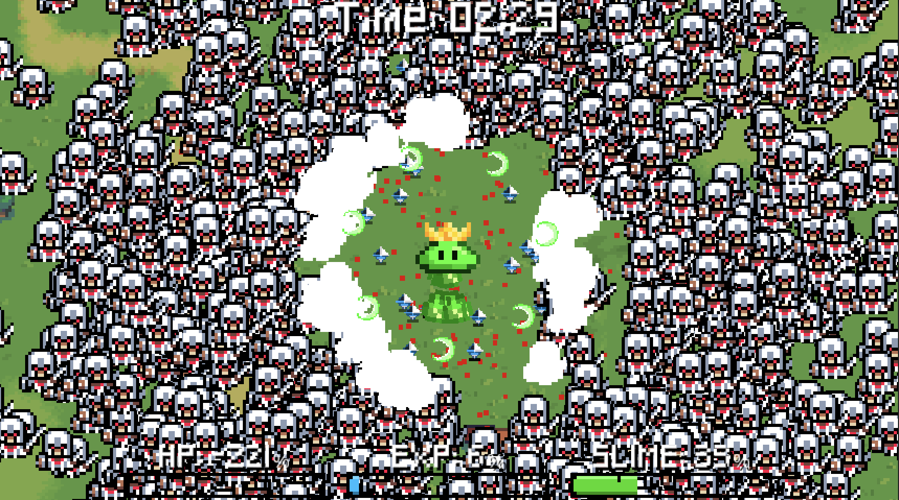

# Slimezilla

A Bullet-Hell Survival game about a slime taking on the Kingdom. Made for Brackeys Game Jam 2022.2. Paid assets have been removed.

You take the crown and become the King of all slimes, but the human kingdom is not happy. There can be only one king. Join forces with your fellow slimes and fight back against the seemly infinite forces of the human kingdom.

Vampire Survivors inspired survival bullet-hell game. Merge with other slimes to heal yourself and grow in size. Collect gems from fallen knights to unlock upgrades and transform from a King slime to a God slime.

## Play Now

Game is available to download and play for free on Windows, Mac, and Linux at https://dispixel.itch.io/slimezilla

## Features

### Bullet-Hell Combat

Fight against infinite waves of increasingly large numbers of Knights! How long can you survive the wrath of the Kingdom?

### Upgrades and Unlocks

Level up your character and unlock and upgrade muliple new abilities and weapons! Merge with you're fellow slimes to gain health and increase in size!

## Dependencies
This project depends on the following paid assets:

- [RPG Overworld Tileset](https://mattwalkden.itch.io/rpg-overworld-tileset)
- [Tiny Heros - Armies](https://itch.io/queue/c/1574960/tiny-tiny-heroes?game_id=143785)
- [Paper UI](https://humblepixel.itch.io/super-asset-bundle-2-adventure-time)
- [Tiny Dungeon](https://oryxdesignlab.itch.io/tiny-dungeon)
